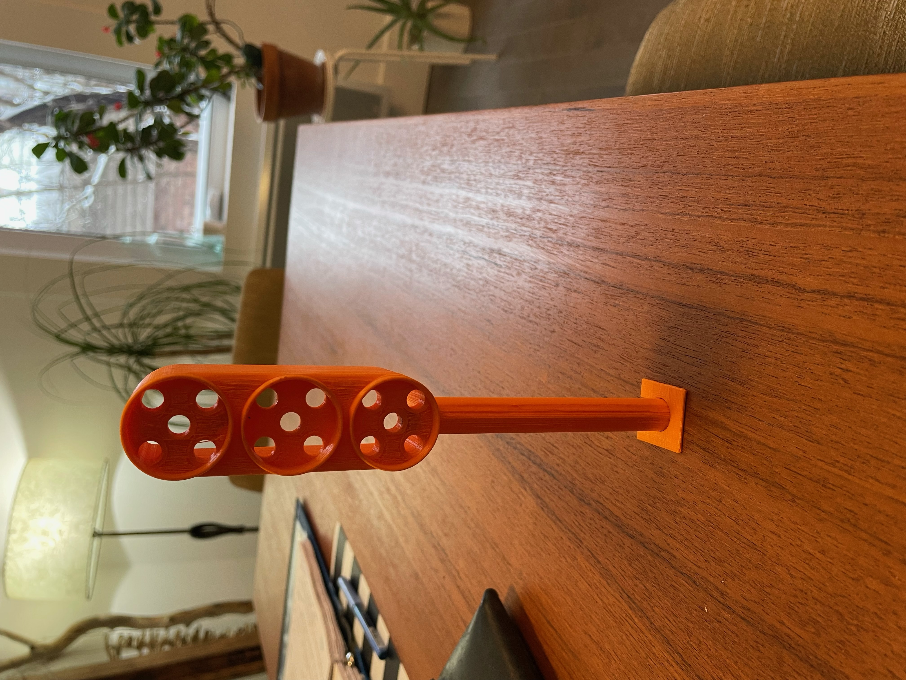
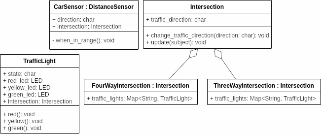

<h1 align="center"> <i><b> ~ Feu de circulation intelligent ~ </i></b></h1>
# Plan de la lumière intelligent
>Rermerciment à **Sacha Blanc-Richard** pour le modèle et l'impression du feu de circulation.

# Impression 3D du feu

# Modélisation

