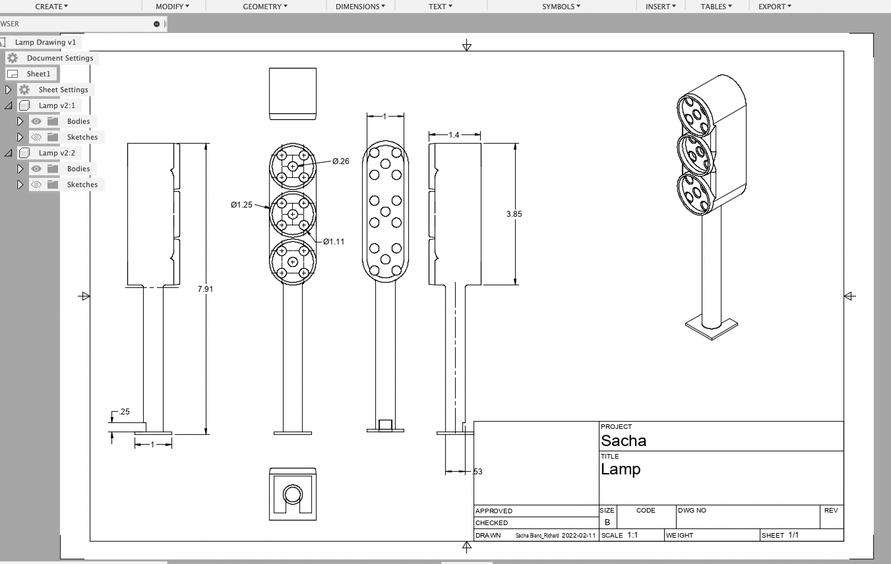

<h1 align="center"><i><b> ~ Feu de circulation intelligent ~ </i></b></h1>

## Plan du feu de circulation intelligent
  >Remerciement à **Sacha Blanc-Richard** pour le modèle et l'impression du feu de circulation.



## Impression 3D du feu de circulation


## Modélisation


## Installation:
Pour installer le code clonez le dépôt, lancez le processus pigpiod.
```
git clone https://github.com/MaximeGazze/feu-intel.git 
cd feu-intel
sudo pigpiod
```

>Vous pouvez optionnellement exécuter pigpiod après chaque démarrage avec
`sudo systemctl enable pigpiod`

Puis vous pouvez exécuter le code avec:
```
python3 main.py
```
